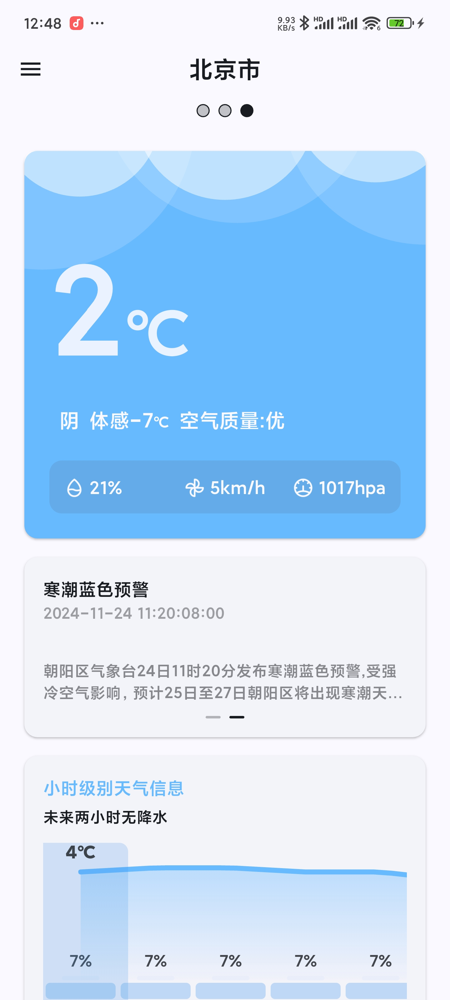

# 柠檬天气的Flutter 版本

## 预览图

## 暗色模式

## 技术栈及其使用的开源库

- Drift 持久化库
- Dio 网络请求库
- GetX 状态管理库
- 自实现的天气转场动画

## 正在做的

~~1.天气动画优化~~
~~2.城市选择支持排序/删除~~
~~3.天气预警~~
~~4.天气详情页~~
~~5.城市选择页面优化~~
~~6.定位功能~~
7.天气预警详情页
